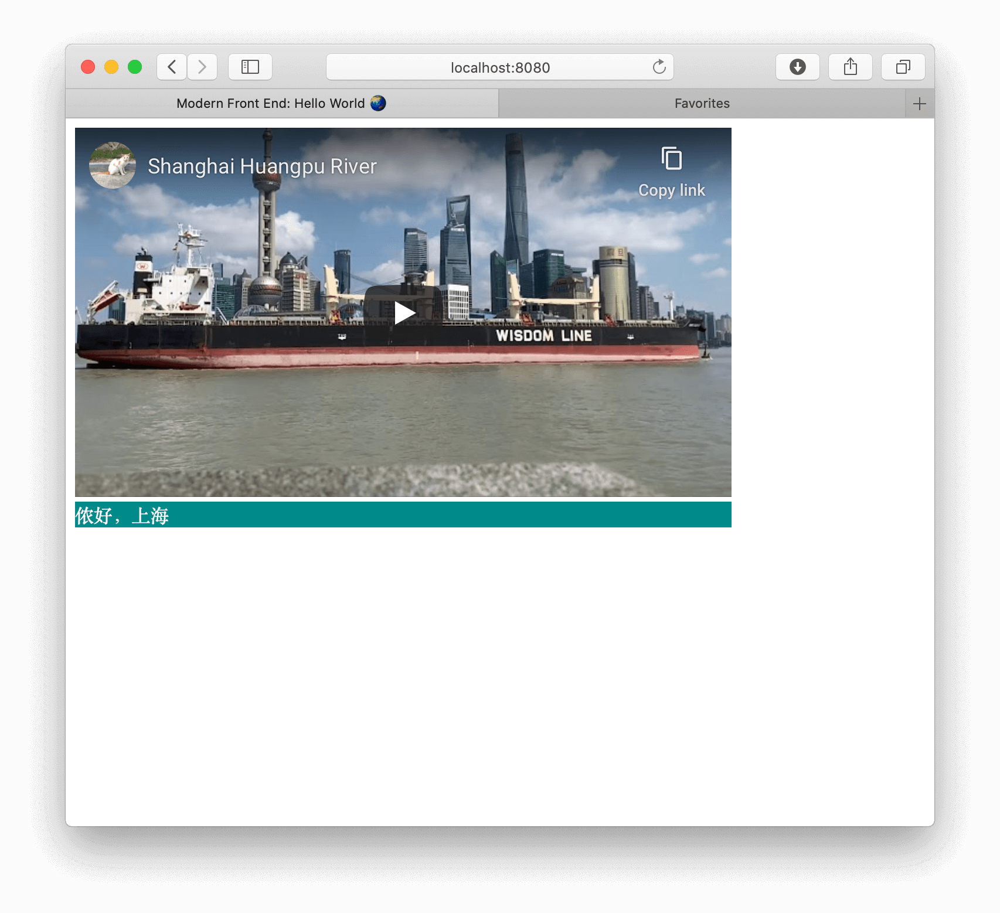

# Modern Front End: Hello, World

## Introduction

* It's a demo web project, which using npm, webpack, babel, sass...



## How to build a project like this

### Use webpack for building

```shell script
$ npm install webpack webpack-cli --save-dev
$ # live serve your project, optional
$ npm install webpack-dev-server --save-dev
```

* More details [Getting Started | webpack](https://webpack.js.org/guides/getting-started/)

### Inject js into html via `html-webpack-plugin`

```shell script
$ npm install html-webpack-plugin --save-dev
```

* Then add config about `html-webpack-plugin` into `webpack.config.js`

### Convert ES2015+ to ES5

```shell script
$ npm install babel-loader @babel/core --save-dev
$ npm install @babel/preset-env --save-dev
```

* Config `webpack.config.js`
  ```js
  module: {
    rules: [
      { test: /\.js$/, exclude: /node_modules/, loader: "babel-loader" }
    ]
  }
  ```
* Config `.babelrc`
  ```json
  {
    "presets": ["@babel/preset-env"]
  }
  ```
* More details [Babel · The compiler for next generation JavaScript](https://babeljs.io/setup#installation)

### Use CSS

```shell script
$ npm i style-loader css-loader --save-dev
```

* Then config `webpack.config.js` module rules

### Use SASS

```shell script
$ npm i sass-loader node-sass --save-dev
```

* Then config `webpack.config.js` module rules
* More details [sass-loader | webpack](https://webpack.js.org/loaders/sass-loader/)

## Reference

* [舒适的前端开发环境是怎样一种体验 - nicolaszhao - 博客园](https://www.cnblogs.com/nicolaszhao/p/7105186.html)
* [一口（很长的）气了解 babel - 知乎](https://zhuanlan.zhihu.com/p/43249121)
